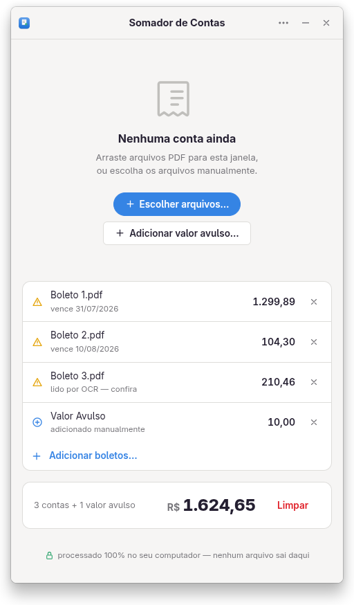

# Somador de Contas

Ferramenta simples para somar valores de boletos e faturas em PDF.

Feita para uso pessoal. Não tem grandes pretensões: só evita que você precise digitar os valores um por um. Foi pensada no formato de boletos bancários brasileiros (procura por rótulos como “valor a pagar”, “total a pagar”, “valor cobrado” etc.).

Tudo roda localmente no seu computador. Nenhum arquivo sai da máquina.



## Como usar

**No navegador (sem instalar nada):**

- Abra o [index.html](index.html) ou o [app/somador-de-contas.html](app/somador-de-contas.html).

Funciona offline. Confira valores identificados com baixa confiança antes de pagar.

**AppImage (Linux):**

Baixe o `.AppImage` na [página de releases](../../releases), dê permissão e execute:

```sh
chmod +x Somador.de.Contas-*.AppImage
./Somador.de.Contas-*.AppImage
```

A partir da versão 3.0.1, o AppImage usa runtime estático e não requer FUSE.

## Observações

Os valores encontrados são editáveis. A edição aceita somente números brasileiros, como `123,45` ou `1.234,56`; uma entrada inválida preserva o valor anterior. Cada linha mostra um indicador de confiança (✓ / ⚠ / ?).

Não é perfeito. Boletos muito diferentes do padrão brasileiro podem precisar de ajuste manual.

## Privacidade

Nada é enviado para a internet. A leitura do PDF e a soma acontecem só no seu computador.

## Compilando do código-fonte

Pré-requisitos: Node.js 22.13 ou superior e Python 3.

### 1. Gerar o HTML

```sh
cd app
npm install
npm test
npm run build
```

Isso atualiza `app/somador-de-contas.html` e `index.html`.

### 2. Gerar o AppImage

```sh
cd ../desktop
npm install
../scripts/build-appimage.sh
```

## Licença

GNU GPLv3. Usa pdf.js (Apache 2.0) e, no AppImage, Electron (MIT).
